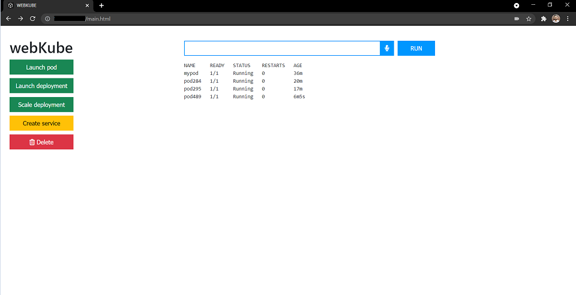

# webKube
Kubernetes playground with voice commands :microphone:

This is a WebApp build using Python-CGI and JS, to interact with `Kubernetes` and run `kubectl` commands (Voice input also supported!).



## Requirements

1. A Kubernetes cluster

Ansible role to configure Kubernetes cluster over AWS -> [link](https://github.com/YashIndane/multinode-K8S-cluster-configure-aws)

The WebApp runs on the `master` node.

2. httpd on master node

install by ->

```
yum install httpd -y
```

## Usage
